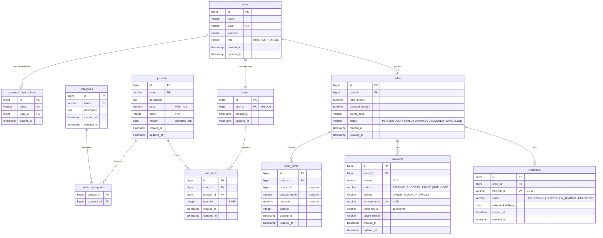
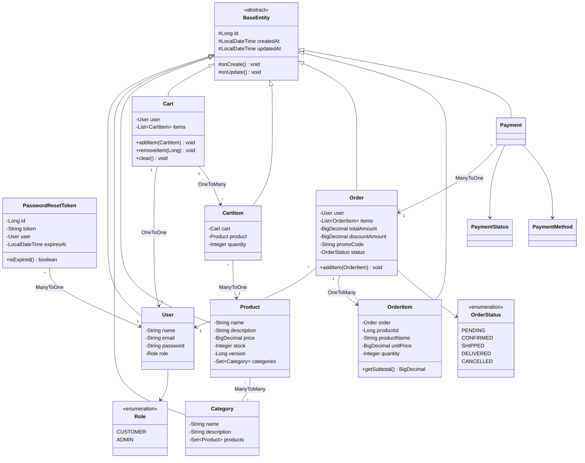
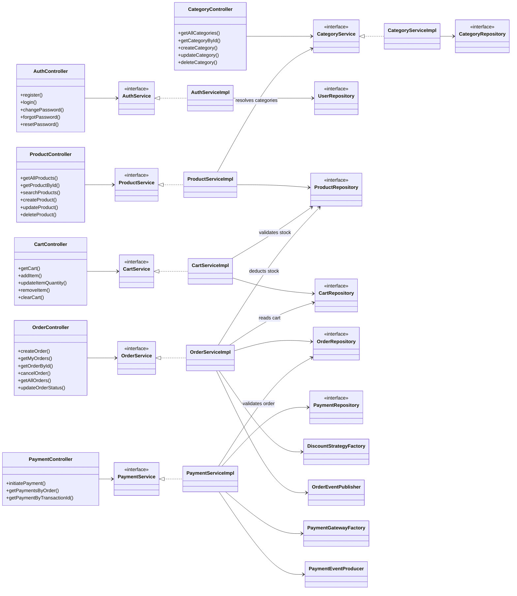
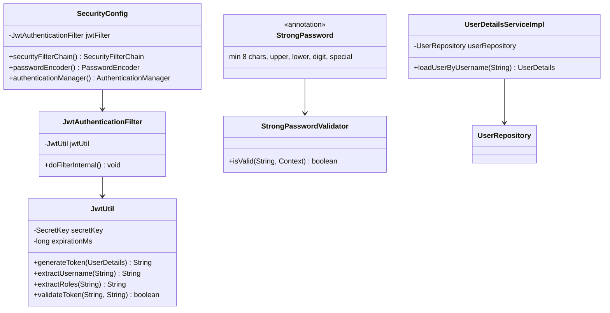
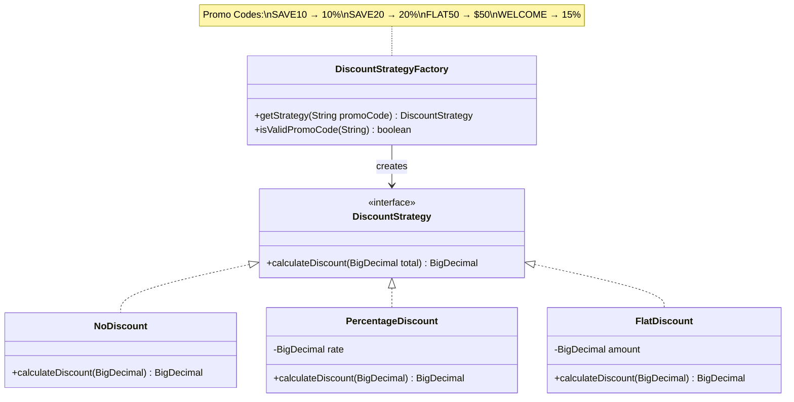
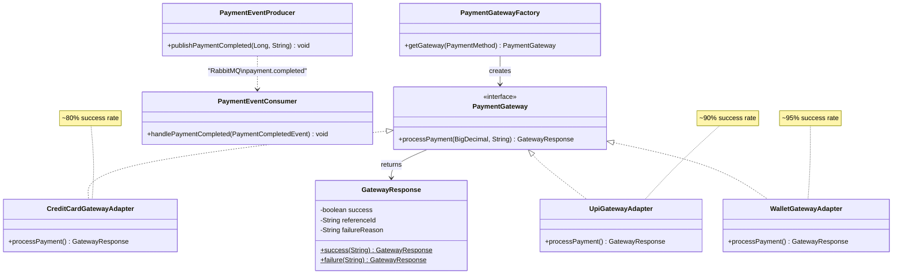
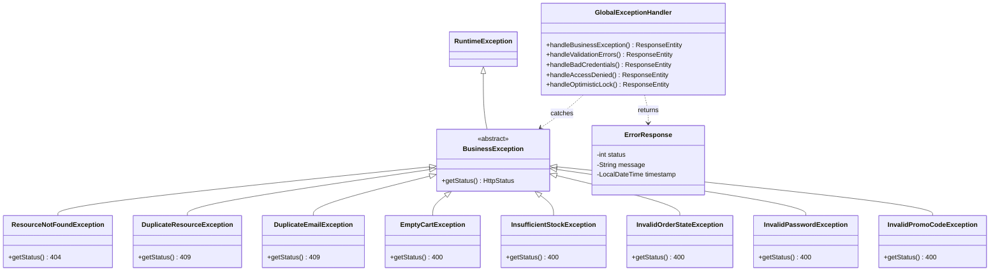
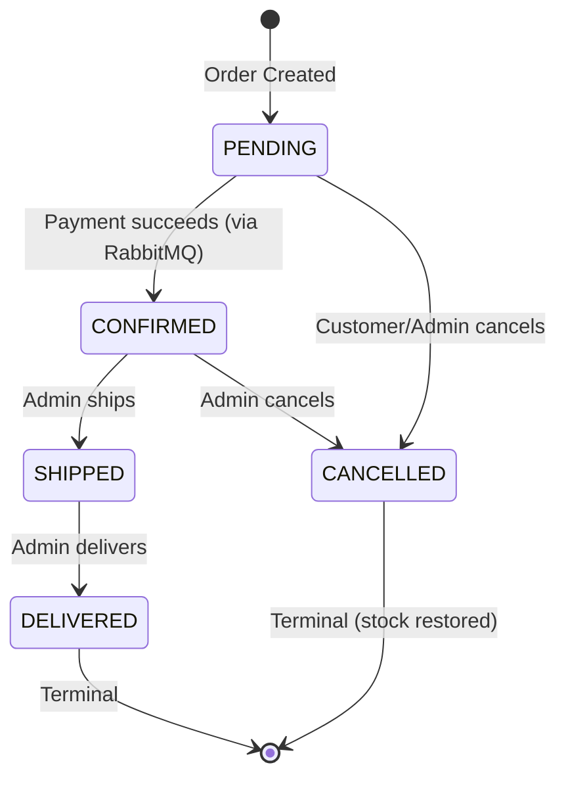

# CommerceX API Reference

Base URL: `http://localhost:8080`

---

## API Documentation

| Module | File | Endpoints |
|--------|------|-----------|
| Auth | [AUTH_API.md](AUTH_API.md) | Register, Login, Change/Reset Password |
| Category | [CATEGORY_API.md](CATEGORY_API.md) | CRUD + Products by Category |
| Product | [PRODUCT_API.md](PRODUCT_API.md) | CRUD + Search/Filter |
| Cart | [CART_API.md](CART_API.md) | View, Add, Update, Remove, Clear |
| Order | [ORDER_API.md](ORDER_API.md) | Checkout, My Orders, Status Lifecycle, Cancel |
| Payment | [PAYMENT_API.md](PAYMENT_API.md) | Initiate, View by Order, View by Transaction |
| Shipment | [SHIPMENT_API.md](SHIPMENT_API.md) | Create, Track, Status Update, Order Lookup |
| Notification | [NOTIFICATION_API.md](NOTIFICATION_API.md) | Simulated Email + SMS (event-driven) |

---

## Access Rules

| Endpoint | Access |
|----------|--------|
| `POST /api/v1/auth/register` | Public |
| `POST /api/v1/auth/login` | Public |
| `POST /api/v1/auth/forgot-password` | Public |
| `POST /api/v1/auth/reset-password` | Public |
| `PUT /api/v1/auth/change-password` | Authenticated |
| `GET /api/v1/products/**` | Public |
| `GET /api/v1/categories/**` | Public |
| POST/PUT/PATCH/DELETE products | ADMIN only |
| POST/PUT/PATCH/DELETE categories | ADMIN only |
| `GET/POST/PUT/DELETE /api/v1/cart/**` | Authenticated |
| `POST /api/v1/orders` | Authenticated |
| `GET /api/v1/orders/my-orders` | Authenticated |
| `GET /api/v1/orders/{id}` | Authenticated |
| `PATCH /api/v1/orders/{id}/cancel` | Authenticated (owner) |
| `GET /api/v1/orders` | ADMIN only |
| `PATCH /api/v1/orders/{id}/status` | ADMIN only |
| `POST /api/v1/payments/initiate` | Authenticated (order owner) |
| `GET /api/v1/payments/order/{orderId}` | Authenticated (order owner) |
| `GET /api/v1/payments/{transactionId}` | Authenticated |
| `POST /api/v1/shipments` | ADMIN only |
| `GET /api/v1/shipments/{trackingId}` | Authenticated |
| `PATCH /api/v1/shipments/{trackingId}/status` | ADMIN only |
| `GET /api/v1/shipments/order/{orderId}` | Authenticated |

---

## Error Responses

All errors return a consistent JSON format:

```json
{
  "status": 404,
  "message": "Category not found with id: 1",
  "timestamp": "2026-03-24T10:30:00"
}
```

| Status | Scenario |
|--------|----------|
| `400 Bad Request` | Validation failed, empty cart, insufficient stock, invalid promo code, invalid order state |
| `401 Unauthorized` | Invalid email or password / missing token |
| `403 Forbidden` | Valid token but insufficient role (e.g., CUSTOMER on admin endpoint) |
| `404 Not Found` | Resource does not exist |
| `409 Conflict` | Duplicate name or email / concurrent stock update |
| `422 Unprocessable Entity` | Invalid state transition (e.g., non-CONFIRMED order, invalid shipment status) |

---

## Database Schema

> PostgreSQL · `jdbc:postgresql://localhost:5432/commercex` · DDL: `spring.jpa.hibernate.ddl-auto=update`

### Full ER Diagram



### Table Summary

| Table | Rows Represent | Key Constraints |
|-------|---------------|-----------------|
| `users` | Registered accounts | email UNIQUE |
| `password_reset_tokens` | Temporary reset tokens | token UNIQUE, FK → users |
| `categories` | Product categories | name UNIQUE |
| `products` | Catalog items | name UNIQUE, `@Version` for optimistic locking |
| `product_categories` | Product ↔ Category mapping | Composite PK (product_id, category_id) |
| `carts` | One shopping cart per user | user_id UNIQUE (1:1) |
| `cart_items` | Items in a cart | UNIQUE (cart_id, product_id), FK → products |
| `orders` | Completed checkouts | FK → users, status as STRING enum |
| `order_items` | Snapshot of purchased items | FK → orders, product data is **snapshotted** (not FK) |
| `payments` | Payment attempts | FK → orders, transaction_id UNIQUE, indexed by order_id |
| `shipments` | Shipment tracking | FK → orders, tracking_id UNIQUE (UUID) |

### Design Decisions

| Decision | Rationale |
|----------|-----------|
| **BIGSERIAL PKs** | Auto-increment, database-managed identity generation |
| **BigDecimal for money** | Avoids floating-point precision errors (0.1 + 0.2 ≠ 0.3 with double) |
| **@Version on products** | Optimistic locking prevents concurrent stock overwrites (409 on conflict) |
| **Enum as STRING** | Stored as text (CUSTOMER, ADMIN) — safe to reorder enum values |
| **Snapshot in order_items** | Product name/price locked at checkout — survives price changes and deletion |
| **Cascade + orphanRemoval** | Cart items and order items auto-delete when removed from parent |
| **Unique (cart_id, product_id)** | One row per product in a cart — duplicates merge quantities |
| **No FK on order_items.product_id** | Intentional — order history must survive product deletion |
| **ManyToOne on payments→orders** | One order can have multiple payment attempts (retry after failure) |
| **Event-driven order confirmation** | Payment success publishes RabbitMQ event → order module reacts independently |
| **Event-driven shipments** | Order CONFIRMED → auto-creates shipment via Spring event listener |
| **Simulated notifications** | Email + SMS logged via SLF4J — swap with real providers later |

---

## Complete Entity Relationship Diagram

> All entities extend `BaseEntity` (id, createdAt, updatedAt).



---

## Service Layer Architecture



---

## Security Architecture



---

## Discount Strategy Pattern



---

## Payment Adapter Pattern



---

## Exception Hierarchy



---

## Order Status State Machine



---

## Individual Module Diagrams

Each API reference file contains its own focused class diagram:

| Module | Diagram Location |
|--------|-----------------|
| Auth & Security | [AUTH_API.md](AUTH_API.md#class-diagram) |
| Category | [CATEGORY_API.md](CATEGORY_API.md#class-diagram) |
| Product | [PRODUCT_API.md](PRODUCT_API.md#class-diagram) |
| Cart | [CART_API.md](CART_API.md#class-diagram) |
| Order & Discount | [ORDER_API.md](ORDER_API.md#class-diagram) |
| Payment & Gateway | [PAYMENT_API.md](PAYMENT_API.md#class-diagram) |
