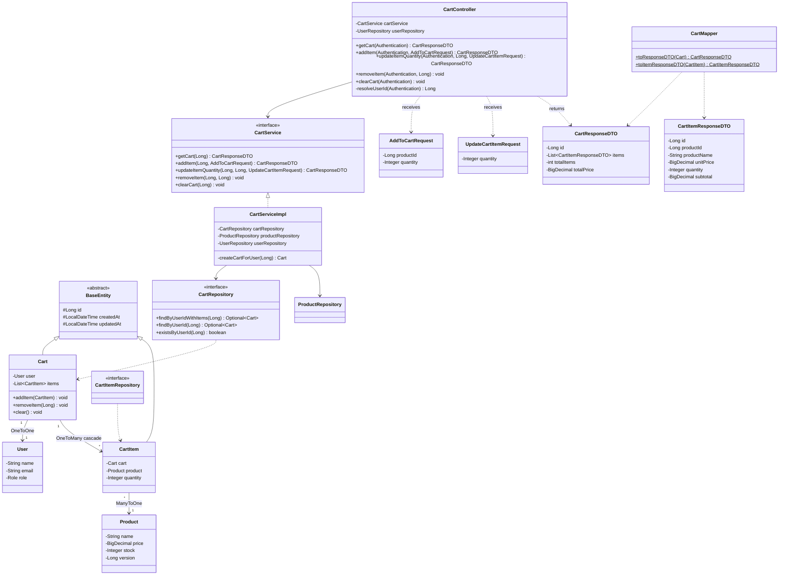
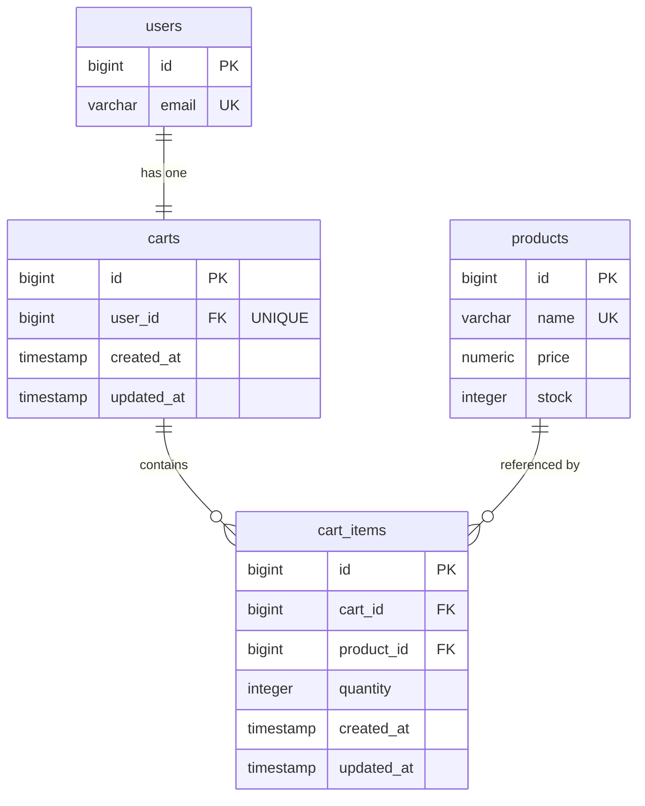

# Cart API Reference

Base URL: `http://localhost:8080`

> All cart endpoints require authentication (JWT token).

---

### 1. View Cart

```
GET /api/v1/cart
```

```bash
curl http://localhost:8080/api/v1/cart \
  -H "Authorization: Bearer <token>"
```

**Response:** `200 OK`

```json
{
  "id": 1,
  "items": [
    {
      "id": 1,
      "productId": 5,
      "productName": "MacBook Pro",
      "unitPrice": 2499.99,
      "quantity": 2,
      "subtotal": 4999.98
    }
  ],
  "totalItems": 2,
  "totalPrice": 4999.98
}
```

> Returns an empty cart (`totalItems: 0`) if the user hasn't added any items yet.

---

### 2. Add Item to Cart

```
POST /api/v1/cart/items
```

```bash
curl -X POST http://localhost:8080/api/v1/cart/items \
  -H "Content-Type: application/json" \
  -H "Authorization: Bearer <token>" \
  -d '{
    "productId": 5,
    "quantity": 2
  }'
```

**Response:** `201 Created` — returns the updated cart.

> If the product already exists in the cart, the quantity is increased (not duplicated).

---

### 3. Update Item Quantity

```
PUT /api/v1/cart/items/{itemId}
```

```bash
curl -X PUT http://localhost:8080/api/v1/cart/items/1 \
  -H "Content-Type: application/json" \
  -H "Authorization: Bearer <token>" \
  -d '{
    "quantity": 3
  }'
```

**Response:** `200 OK` — returns the updated cart.

---

### 4. Remove Item from Cart

```
DELETE /api/v1/cart/items/{itemId}
```

```bash
curl -X DELETE http://localhost:8080/api/v1/cart/items/1 \
  -H "Authorization: Bearer <token>"
```

**Response:** `204 No Content`

---

### 5. Clear Entire Cart

```
DELETE /api/v1/cart
```

```bash
curl -X DELETE http://localhost:8080/api/v1/cart \
  -H "Authorization: Bearer <token>"
```

**Response:** `204 No Content`

---

### Business Rules

| Rule | Behavior |
|------|----------|
| **One cart per user** | Cart is auto-created on first addItem |
| **Duplicate products** | Adding an existing product increases quantity |
| **Stock check** | Validates available stock at add/update time |
| **Price is live** | Uses the current product price (not cached) |
| **Stock not reserved** | Stock is only deducted at checkout (order creation) |
| **Quantity bounds** | Minimum 1, maximum 999 per item |

---

### Error Responses

| Status | Scenario |
|--------|----------|
| `400 Bad Request` | Insufficient stock, invalid quantity |
| `401 Unauthorized` | Missing or invalid JWT token |
| `404 Not Found` | Product or cart item doesn't exist |

---

## Class Diagram



---

## Database Tables

### `carts`

| Column | Type | Nullable | Unique | FK | Notes |
|--------|------|----------|--------|---|-------|
| `id` | BIGSERIAL | NO | PK | — | Primary key |
| `user_id` | BIGINT | NO | YES | `users.id` | One cart per user |
| `created_at` | TIMESTAMP | NO | NO | — | Immutable after insert |
| `updated_at` | TIMESTAMP | NO | NO | — | Auto-refreshed on update |

**Constraints:** Unique on `user_id` (enforces one-to-one)

### `cart_items`

| Column | Type | Nullable | Unique | FK | Notes |
|--------|------|----------|--------|---|-------|
| `id` | BIGSERIAL | NO | PK | — | Primary key |
| `cart_id` | BIGINT | NO | NO | `carts.id` | Parent cart |
| `product_id` | BIGINT | NO | NO | `products.id` | Referenced product |
| `quantity` | INTEGER | NO | NO | — | Must be >= 1, max 999 |
| `created_at` | TIMESTAMP | NO | NO | — | Immutable after insert |
| `updated_at` | TIMESTAMP | NO | NO | — | Auto-refreshed on update |

**Constraints:** Unique on (`cart_id`, `product_id`) — one entry per product per cart
**Cascade:** Deleted when removed from cart (orphanRemoval)

### ER Diagram


