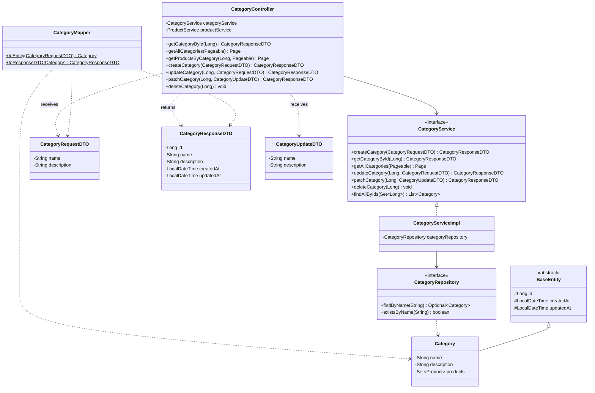
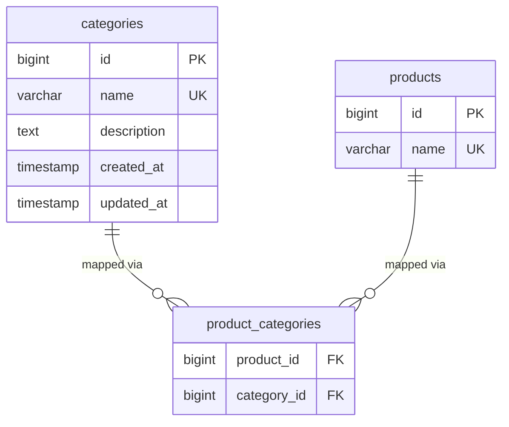

# Category API Reference

Base URL: `http://localhost:8080`

> Write endpoints (POST/PUT/PATCH/DELETE) require an `ADMIN` JWT.
> Pass the token as: `Authorization: Bearer <token>`

---

### 1. Create Category

```
POST /api/v1/categories
```

```bash
curl -X POST http://localhost:8080/api/v1/categories \
  -H "Content-Type: application/json" \
  -H "Authorization: Bearer <token>" \
  -d '{
    "name": "Electronics",
    "description": "Phones, laptops, gadgets"
  }'
```

**Response:** `201 Created`

---

### 2. Get Category by ID

```
GET /api/v1/categories/{id}
```

```bash
curl -X GET http://localhost:8080/api/v1/categories/1
```

**Response:** `200 OK`

---

### 3. Get All Categories (Paginated)

```
GET /api/v1/categories?page=0&size=10&sort=name,asc
```

```bash
curl -X GET "http://localhost:8080/api/v1/categories?page=0&size=10&sort=name,asc"
```

**Response:** `200 OK` (returns a `Page` object with `content`, `totalElements`, `totalPages`, etc.)

---

### 4. Get Products by Category

```
GET /api/v1/categories/{id}/products?page=0&size=10
```

```bash
curl -X GET "http://localhost:8080/api/v1/categories/1/products?page=0&size=10"
```

**Response:** `200 OK` (paginated list of products belonging to that category)

---

### 5. Update Category (Full)

```
PUT /api/v1/categories/{id}
```

```bash
curl -X PUT http://localhost:8080/api/v1/categories/1 \
  -H "Content-Type: application/json" \
  -H "Authorization: Bearer <token>" \
  -d '{
    "name": "Electronics & Gadgets",
    "description": "Updated description"
  }'
```

**Response:** `200 OK`

---

### 6. Patch Category (Partial)

```
PATCH /api/v1/categories/{id}
```

```bash
curl -X PATCH http://localhost:8080/api/v1/categories/1 \
  -H "Content-Type: application/json" \
  -H "Authorization: Bearer <token>" \
  -d '{
    "description": "Only updating description"
  }'
```

**Response:** `200 OK`

---

### 7. Delete Category

```
DELETE /api/v1/categories/{id}
```

```bash
curl -X DELETE http://localhost:8080/api/v1/categories/1 \
  -H "Authorization: Bearer <token>"
```

**Response:** `204 No Content`

---

## Class Diagram



---

## Database Tables

### `categories`

| Column | Type | Nullable | Unique | Default | Notes |
|--------|------|----------|--------|---------|-------|
| `id` | BIGSERIAL | NO | PK | auto | Primary key |
| `name` | VARCHAR(255) | NO | YES | — | Category name |
| `description` | TEXT | YES | NO | NULL | Optional description |
| `created_at` | TIMESTAMP | NO | NO | NOW() | Immutable after insert |
| `updated_at` | TIMESTAMP | NO | NO | NOW() | Auto-refreshed on update |

**Indexes:** Unique on `name`

### ER Diagram


