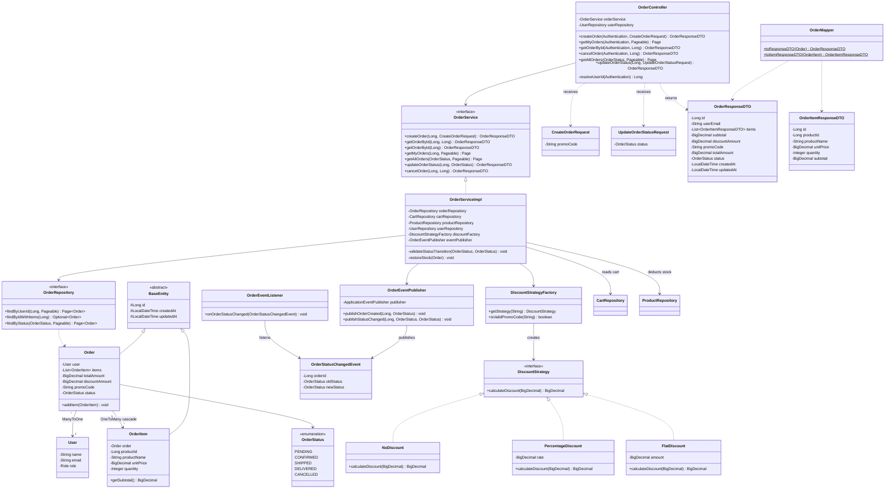
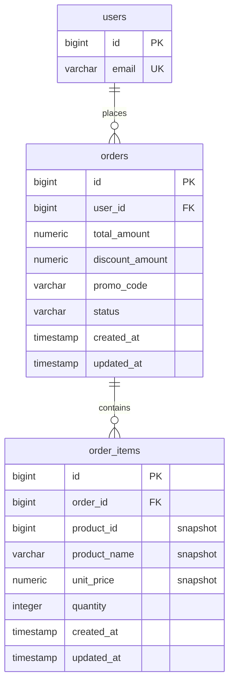

# Order API Reference

Base URL: `http://localhost:8080`

> All order endpoints require authentication (JWT token).
> Admin-only endpoints are marked with 🔒.

---

### 1. Place Order (Checkout)

```
POST /api/v1/orders
```

Converts the cart into an order. Snapshots product data, applies discount, deducts stock, and clears the cart — all atomically.

```bash
curl -X POST http://localhost:8080/api/v1/orders \
  -H "Content-Type: application/json" \
  -H "Authorization: Bearer <token>" \
  -d '{
    "promoCode": "SAVE10"
  }'
```

> `promoCode` is optional. Omit or send `{}` for no discount.

**Response:** `201 Created`

```json
{
  "id": 1,
  "userEmail": "john@example.com",
  "items": [
    {
      "id": 1,
      "productId": 5,
      "productName": "MacBook Pro",
      "unitPrice": 2499.99,
      "quantity": 2,
      "subtotal": 4999.98
    }
  ],
  "subtotal": 4999.98,
  "discountAmount": 500.00,
  "promoCode": "SAVE10",
  "totalAmount": 4499.98,
  "status": "PENDING",
  "createdAt": "2026-03-25T22:00:00",
  "updatedAt": "2026-03-25T22:00:00"
}
```

---

### 2. View My Orders

```
GET /api/v1/orders/my-orders
```

```bash
curl http://localhost:8080/api/v1/orders/my-orders \
  -H "Authorization: Bearer <token>"
```

Supports pagination: `?page=0&size=10&sort=createdAt,desc`

**Response:** `200 OK` — paginated list of orders.

---

### 3. View Single Order

```
GET /api/v1/orders/{id}
```

```bash
curl http://localhost:8080/api/v1/orders/1 \
  -H "Authorization: Bearer <token>"
```

**Response:** `200 OK` — full order with items.

---

### 4. Cancel My Order

```
PATCH /api/v1/orders/{id}/cancel
```

Customers can cancel their own **PENDING** orders. Stock is automatically restored.

```bash
curl -X PATCH http://localhost:8080/api/v1/orders/1/cancel \
  -H "Authorization: Bearer <token>"
```

**Response:** `200 OK` — order with status `CANCELLED`.

---

### 5. 🔒 List All Orders (Admin)

```
GET /api/v1/orders
```

```bash
curl http://localhost:8080/api/v1/orders \
  -H "Authorization: Bearer <admin-token>"
```

Optional filter: `?status=PENDING` (PENDING, CONFIRMED, SHIPPED, DELIVERED, CANCELLED)

**Response:** `200 OK` — paginated list of all orders.

---

### 6. 🔒 Update Order Status (Admin)

```
PATCH /api/v1/orders/{id}/status
```

```bash
curl -X PATCH http://localhost:8080/api/v1/orders/1/status \
  -H "Content-Type: application/json" \
  -H "Authorization: Bearer <admin-token>" \
  -d '{
    "status": "CONFIRMED"
  }'
```

**Response:** `200 OK` — order with updated status.

---

### Promo Codes

| Code | Discount |
|------|----------|
| `SAVE10` | 10% off |
| `SAVE20` | 20% off |
| `FLAT50` | $50 off |
| `WELCOME` | 15% off |

> In a real system, these would come from a database. Currently hardcoded for testing.

---

### Order Status Lifecycle

```
PENDING ──→ CONFIRMED ──→ SHIPPED ──→ DELIVERED
  │              │
  └──→ CANCELLED ←┘
```

| Transition | Who |
|-----------|-----|
| PENDING → CONFIRMED | Automatic (on successful payment via PaymentEventConsumer) |
| PENDING → CANCELLED | Customer or Admin |
| CONFIRMED → SHIPPED | Admin |
| CONFIRMED → CANCELLED | Admin (before shipping) |
| SHIPPED → DELIVERED | Admin |

> DELIVERED and CANCELLED are terminal states — no further transitions allowed.

---

### Checkout Business Rules

| Rule | Behavior |
|------|----------|
| **Empty cart** | Returns `400` — can't checkout with empty cart |
| **Stock check** | Verifies stock for every item at checkout time |
| **Stock deduction** | Deducted atomically during order creation |
| **Stock restore** | Restored automatically on cancellation |
| **Price snapshot** | Product price is locked at checkout — future price changes don't affect the order |
| **Cart cleared** | Cart is emptied after successful checkout |
| **Atomic** | If any item fails stock check, entire order rolls back |
| **Invalid promo** | Returns `400` — order not created |
| **Optimistic locking** | Concurrent stock updates return `409 Conflict` — retry the operation |
| **Order ownership** | Customers can only view/cancel their own orders; admins can view any order |

---

### Error Responses

| Status | Scenario |
|--------|----------|
| `400 Bad Request` | Empty cart, insufficient stock, invalid promo code, invalid status transition |
| `401 Unauthorized` | Missing or invalid JWT token |
| `403 Forbidden` | Non-admin trying admin endpoints |
| `404 Not Found` | Order not found or not owned by the current user |
| `409 Conflict` | Concurrent stock update detected — retry the operation |

---

## Class Diagram



---

## Database Tables

### `orders`

| Column | Type | Nullable | Unique | FK | Notes |
|--------|------|----------|--------|---|-------|
| `id` | BIGSERIAL | NO | PK | — | Primary key |
| `user_id` | BIGINT | NO | NO | `users.id` | Order owner |
| `total_amount` | NUMERIC(19,2) | NO | NO | — | Final amount after discount |
| `discount_amount` | NUMERIC(19,2) | NO | NO | — | Discount applied (default 0.00) |
| `promo_code` | VARCHAR(255) | YES | NO | — | Applied promo code (nullable) |
| `status` | VARCHAR(255) | NO | NO | — | PENDING, CONFIRMED, SHIPPED, DELIVERED, CANCELLED |
| `created_at` | TIMESTAMP | NO | NO | — | Immutable after insert |
| `updated_at` | TIMESTAMP | NO | NO | — | Auto-refreshed on update |

### `order_items`

| Column | Type | Nullable | Unique | FK | Notes |
|--------|------|----------|--------|---|-------|
| `id` | BIGSERIAL | NO | PK | — | Primary key |
| `order_id` | BIGINT | NO | NO | `orders.id` | Parent order |
| `product_id` | BIGINT | NO | NO | — | Snapshot reference (NOT a FK) |
| `product_name` | VARCHAR(255) | NO | NO | — | Snapshot of name at order time |
| `unit_price` | NUMERIC(19,2) | NO | NO | — | Snapshot of price at order time |
| `quantity` | INTEGER | NO | NO | — | Ordered quantity |
| `created_at` | TIMESTAMP | NO | NO | — | Immutable after insert |
| `updated_at` | TIMESTAMP | NO | NO | — | Auto-refreshed on update |

> **Why snapshot?** `order_items` stores `product_id`, `product_name`, and `unit_price` as plain values — not foreign keys. This means order history survives product price changes and even product deletion.

**Cascade:** Order items are deleted when the order is deleted (orphanRemoval)

### ER Diagram


