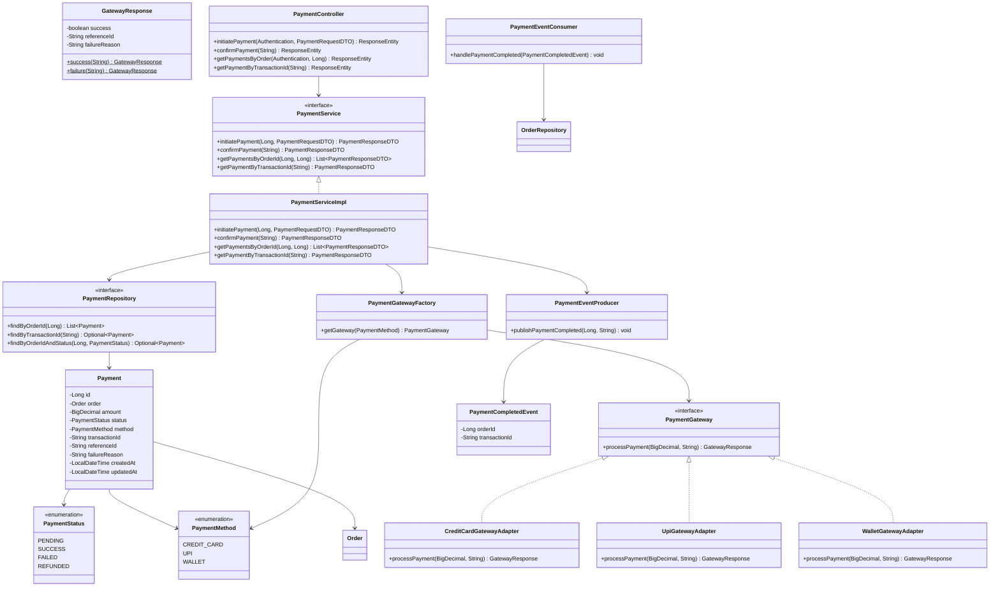
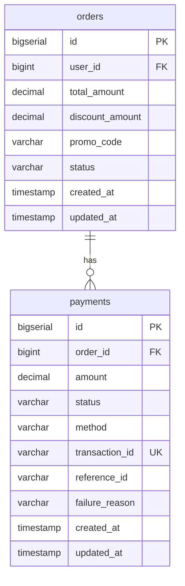

# Payment API Reference

## Overview
The Payment module provides simulated payment processing with multiple gateway adapters, event-driven order confirmation via RabbitMQ, and complete payment lifecycle management.

**Base URL:** `/api/v1/payments`  
**Authentication:** All endpoints require a valid JWT token (Bearer).

---

## Endpoints

### 1. Initiate Payment
**POST** `/api/v1/payments/initiate`

Initiates a payment for a PENDING order. The payment is routed to the appropriate gateway adapter based on the chosen payment method.

**Request Body:**
```json
{
  "orderId": 1,
  "method": "CREDIT_CARD"
}
```

| Field    | Type   | Required | Description                                    |
|----------|--------|----------|------------------------------------------------|
| orderId  | Long   | Yes      | The order to pay for (must be PENDING)         |
| method   | String | Yes      | `CREDIT_CARD`, `UPI`, or `WALLET`              |

**Success Response (201 Created):**
```json
{
  "id": 1,
  "orderId": 1,
  "amount": 199.99,
  "status": "SUCCESS",
  "method": "CREDIT_CARD",
  "transactionId": "a1b2c3d4-e5f6-7890-abcd-ef1234567890",
  "referenceId": "CC-A1B2C3D4",
  "failureReason": null,
  "createdAt": "2024-01-15T10:30:00",
  "updatedAt": "2024-01-15T10:30:01"
}
```

**Failed Payment Response (201 Created — payment record created but gateway declined):**
```json
{
  "id": 2,
  "orderId": 1,
  "amount": 199.99,
  "status": "FAILED",
  "method": "UPI",
  "transactionId": "b2c3d4e5-f6a7-8901-bcde-f12345678901",
  "referenceId": null,
  "failureReason": "UPI transaction timeout",
  "createdAt": "2024-01-15T10:35:00",
  "updatedAt": "2024-01-15T10:35:01"
}
```

**Error Responses:**
| Status | Condition                                  |
|--------|--------------------------------------------|
| 400    | Order is not in PENDING status             |
| 400    | Order already has a successful payment     |
| 404    | Order not found or not owned by user       |

---

### 2. Get Payments by Order
**GET** `/api/v1/payments/order/{orderId}`

Returns all payment attempts for a specific order (only if the requesting user owns the order).

**Success Response (200 OK):**
```json
[
  {
    "id": 2,
    "orderId": 1,
    "amount": 199.99,
    "status": "FAILED",
    "method": "UPI",
    "transactionId": "b2c3d4e5-...",
    "referenceId": null,
    "failureReason": "UPI transaction timeout",
    "createdAt": "2024-01-15T10:35:00",
    "updatedAt": "2024-01-15T10:35:01"
  },
  {
    "id": 3,
    "orderId": 1,
    "amount": 199.99,
    "status": "SUCCESS",
    "method": "CREDIT_CARD",
    "transactionId": "a1b2c3d4-...",
    "referenceId": "CC-A1B2C3D4",
    "failureReason": null,
    "createdAt": "2024-01-15T10:40:00",
    "updatedAt": "2024-01-15T10:40:01"
  }
]
```

---

### 3. Confirm Payment
**POST** `/api/v1/payments/confirm/{transactionId}`

Confirms a PENDING payment by transaction ID. Useful for async/webhook-style flows where the gateway confirms later. On success, publishes a `PaymentCompletedEvent` to update the order status to CONFIRMED.

**Success Response (200 OK):**
```json
{
  "id": 1,
  "orderId": 1,
  "amount": 199.99,
  "status": "SUCCESS",
  "method": "CREDIT_CARD",
  "transactionId": "a1b2c3d4-e5f6-7890-abcd-ef1234567890",
  "referenceId": null,
  "failureReason": null,
  "createdAt": "2024-01-15T10:30:00",
  "updatedAt": "2024-01-15T10:30:05"
}
```

**Error Responses:**
| Status | Condition                                    |
|--------|----------------------------------------------|
| 400    | Payment is not in PENDING status             |
| 404    | Payment not found with that transaction ID   |

---

### 4. Get Payment by Transaction ID
**GET** `/api/v1/payments/{transactionId}`

Returns a specific payment by its unique transaction ID.

**Success Response (200 OK):**
```json
{
  "id": 3,
  "orderId": 1,
  "amount": 199.99,
  "status": "SUCCESS",
  "method": "CREDIT_CARD",
  "transactionId": "a1b2c3d4-e5f6-7890-abcd-ef1234567890",
  "referenceId": "CC-A1B2C3D4",
  "failureReason": null,
  "createdAt": "2024-01-15T10:40:00",
  "updatedAt": "2024-01-15T10:40:01"
}
```

| Status | Condition                           |
|--------|-------------------------------------|
| 404    | Payment not found with that txn ID  |

---

## Payment Flows

### Flow 1: Initiate Payment (synchronous gateway)
```
Customer                    PaymentController          PaymentService           Gateway Adapter         RabbitMQ/Direct       OrderService
   │                              │                         │                        │                    │                      │
   │  POST /payments/initiate     │                         │                        │                    │                      │
   │─────────────────────────────>│                         │                        │                    │                      │
   │                              │  initiatePayment()      │                        │                    │                      │
   │                              │────────────────────────>│                        │                    │                      │
   │                              │                         │  Validate order        │                    │                      │
   │                              │                         │  (PENDING + owned)     │                    │                      │
   │                              │                         │                        │                    │                      │
   │                              │                         │  Save PENDING payment  │                    │                      │
   │                              │                         │                        │                    │                      │
   │                              │                         │  processPayment()      │                    │                      │
   │                              │                         │───────────────────────>│                    │                      │
   │                              │                         │                        │  Simulate gateway  │                      │
   │                              │                         │  GatewayResponse       │                    │                      │
   │                              │                         │<───────────────────────│                    │                      │
   │                              │                         │                        │                    │                      │
   │                              │                         │  If SUCCESS:           │                    │                      │
   │                              │                         │  Publish event ────────│───────────────────>│                      │
   │                              │                         │                        │                    │  PaymentEventConsumer│
   │                              │                         │                        │                    │─────────────────────>│
   │                              │                         │                        │                    │  Order → CONFIRMED   │
   │                              │                         │                        │                    │                      │
   │  PaymentResponseDTO          │                         │                        │                    │                      │
   │<─────────────────────────────│                         │                        │                    │                      │
```

### Flow 2: Confirm Payment (async/webhook)
```
Gateway/Webhook             PaymentController          PaymentService                                RabbitMQ/Direct       OrderService
   │                              │                         │                                           │                      │
   │  POST /payments/confirm/{txn}│                         │                                           │                      │
   │─────────────────────────────>│                         │                                           │                      │
   │                              │  confirmPayment(txnId)  │                                           │                      │
   │                              │────────────────────────>│                                           │                      │
   │                              │                         │  Find PENDING payment                     │                      │
   │                              │                         │  Update → SUCCESS                         │                      │
   │                              │                         │  Publish event ───────────────────────────>│                      │
   │                              │                         │                                           │  PaymentEventConsumer│
   │                              │                         │                                           │─────────────────────>│
   │                              │                         │                                           │  Order → CONFIRMED   │
   │                              │                         │                                           │                      │
   │  PaymentResponseDTO          │                         │                                           │                      │
   │<─────────────────────────────│                         │                                           │                      │
```

> **Note:** When RabbitMQ is unavailable, the `PaymentEventProducer` falls back to calling
> `PaymentEventConsumer.handlePaymentCompleted()` directly in-memory. The event consumer
> uses `REQUIRES_NEW` transaction propagation so a failure in order confirmation doesn't
> roll back the payment save.

---

## Enums

### PaymentStatus
| Value    | Description                             |
|----------|-----------------------------------------|
| PENDING  | Payment initiated, awaiting gateway     |
| SUCCESS  | Gateway confirmed funds captured        |
| FAILED   | Gateway rejected the transaction        |
| REFUNDED | Payment reversed after success          |

### PaymentMethod
| Value       | Gateway Adapter             | Simulated Success Rate |
|-------------|-----------------------------|------------------------|
| CREDIT_CARD | CreditCardGatewayAdapter    | ~80%                   |
| UPI         | UpiGatewayAdapter           | ~90%                   |
| WALLET      | WalletGatewayAdapter        | ~95%                   |

---

## Design Patterns

### Adapter Pattern (PaymentGateway)
Each payment method has a different gateway "API." The Adapter pattern normalizes them behind a single `PaymentGateway` interface:

```java
public interface PaymentGateway {
    GatewayResponse processPayment(BigDecimal amount, String transactionId);
}
```

Implementations: `CreditCardGatewayAdapter`, `UpiGatewayAdapter`, `WalletGatewayAdapter`

### Factory Pattern (PaymentGatewayFactory)
Returns the correct adapter based on `PaymentMethod`:

```java
@Component
public class PaymentGatewayFactory {
    public PaymentGateway getGateway(PaymentMethod method) {
        return switch (method) {
            case CREDIT_CARD -> new CreditCardGatewayAdapter();
            case UPI         -> new UpiGatewayAdapter();
            case WALLET      -> new WalletGatewayAdapter();
        };
    }
}
```

### Event-Driven Architecture (RabbitMQ with in-memory fallback)
On successful payment, a `PaymentCompletedEvent` is published to RabbitMQ. The `PaymentEventConsumer` listens and updates the order status to CONFIRMED — loose coupling between payment and order modules.

When RabbitMQ is unavailable, `PaymentEventProducer` catches the `AmqpConnectException` and calls the consumer directly in-memory. The consumer uses `@Transactional(propagation = REQUIRES_NEW)` to ensure the order update runs in its own transaction.

```
PaymentService → [payment.exchange] → payment.completed → [payment.completed.queue] → PaymentEventConsumer → Order.CONFIRMED
                     ↓ (if RabbitMQ down)
              PaymentEventProducer → PaymentEventConsumer.handlePaymentCompleted() → Order.CONFIRMED
```

---

## Class Diagram



---

## Database Table Structure

### `payments` Table
| Column         | Type           | Nullable | Unique | Notes                              |
|----------------|----------------|----------|--------|------------------------------------|
| id             | BIGSERIAL      | No       | Yes    | PK, auto-generated                 |
| order_id       | BIGINT         | No       | No     | FK → orders(id)                    |
| amount         | DECIMAL(12,2)  | No       | No     | Payment amount                     |
| status         | VARCHAR(20)    | No       | No     | PENDING, SUCCESS, FAILED, REFUNDED |
| method         | VARCHAR(20)    | No       | No     | CREDIT_CARD, UPI, WALLET           |
| transaction_id | VARCHAR(36)    | No       | Yes    | UUID, unique per attempt           |
| reference_id   | VARCHAR(255)   | Yes      | No     | Gateway reference (e.g., CC-A1B2)  |
| failure_reason | VARCHAR(255)   | Yes      | No     | Reason for failure (if any)        |
| created_at     | TIMESTAMP      | No       | No     | Auto-set on creation               |
| updated_at     | TIMESTAMP      | No       | No     | Auto-updated on modification       |

**Indexes:**
- `idx_payment_order_id` on `order_id` (find payments by order)
- `idx_payment_transaction_id` on `transaction_id` (unique, lookup by txn ID)

### ER Diagram



---

## RabbitMQ Configuration

| Property             | Value                     |
|----------------------|---------------------------|
| Exchange             | `payment.exchange` (Topic)|
| Queue                | `payment.completed.queue` |
| Routing Key          | `payment.completed`       |
| Message Format       | JSON (Jackson)            |

**Event Flow:**
1. `PaymentServiceImpl` processes a successful payment (via `initiatePayment` or `confirmPayment`)
2. `PaymentEventProducer` attempts to publish `PaymentCompletedEvent` to `payment.exchange`
3. If RabbitMQ is available: message is routed via key `payment.completed` to `payment.completed.queue`
4. If RabbitMQ is unavailable: `PaymentEventProducer` calls `PaymentEventConsumer.handlePaymentCompleted()` directly
5. `PaymentEventConsumer` updates order status to `CONFIRMED` (in a `REQUIRES_NEW` transaction)

---

## Error Handling

| Exception                   | HTTP Status | Condition                                       |
|-----------------------------|-------------|--------------------------------------------------|
| ResourceNotFoundException   | 404         | Order or payment not found                       |
| InvalidOrderStateException  | 400         | Order not PENDING, already paid, or payment not PENDING |

All errors return the standard `ErrorResponse` format:
```json
{
  "status": 400,
  "message": "Cannot pay for order in CONFIRMED status. Only PENDING orders can be paid.",
  "timestamp": "2024-01-15T10:30:00"
}
```
