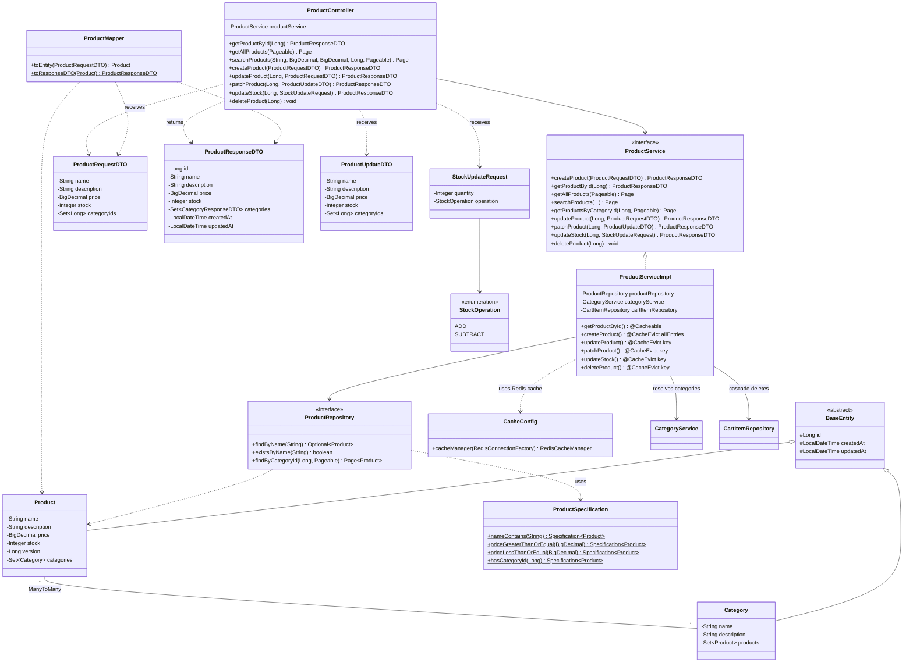
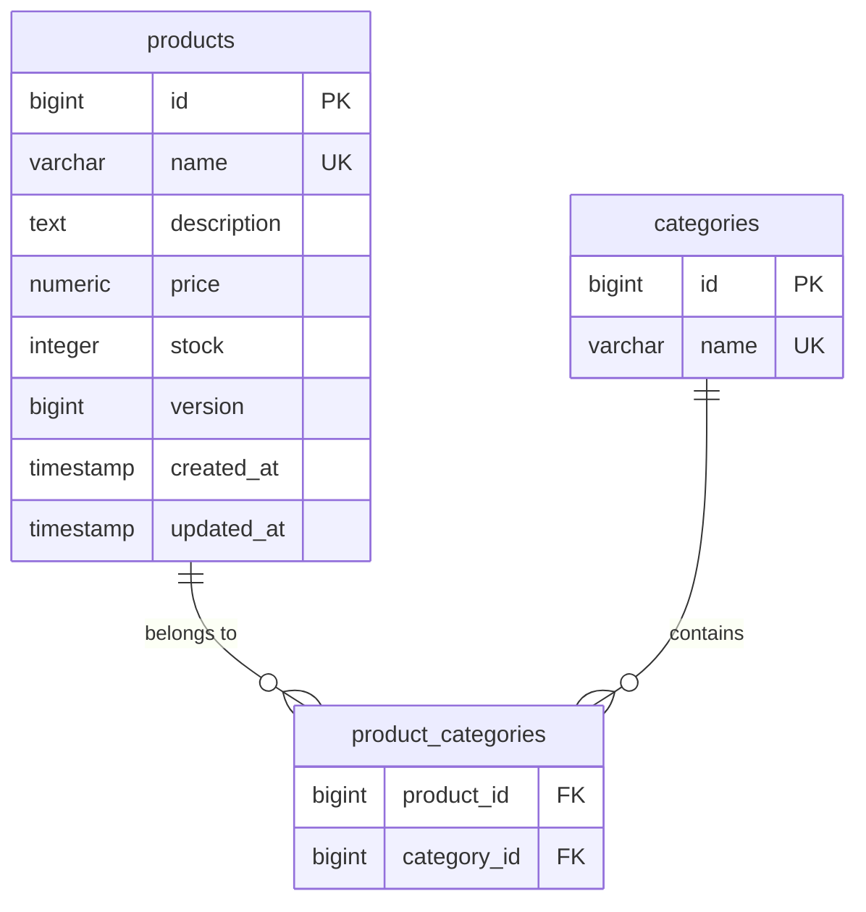

# Product API Reference

Base URL: `http://localhost:8080`

> Write endpoints (POST/PUT/PATCH/DELETE) require an `ADMIN` JWT.
> Pass the token as: `Authorization: Bearer <token>`

---

### 1. Create Product

```
POST /api/v1/products
```

```bash
curl -X POST http://localhost:8080/api/v1/products \
  -H "Content-Type: application/json" \
  -H "Authorization: Bearer <token>" \
  -d '{
    "name": "iPhone 16",
    "description": "Latest Apple smartphone",
    "price": 999.99,
    "stock": 50,
    "categoryIds": [1, 2]
  }'
```

**Response:** `201 Created`

---

### 2. Get Product by ID

```
GET /api/v1/products/{id}
```

```bash
curl -X GET http://localhost:8080/api/v1/products/1
```

**Response:** `200 OK`

---

### 3. Get All Products (Paginated)

```
GET /api/v1/products?page=0&size=10&sort=price,desc
```

```bash
curl -X GET "http://localhost:8080/api/v1/products?page=0&size=10&sort=price,desc"
```

**Response:** `200 OK` (returns a `Page` object with `content`, `totalElements`, `totalPages`, etc.)

---

### 4. Search/Filter Products

```
GET /api/v1/products/search?name=iphone&minPrice=500&maxPrice=1500&categoryId=1&page=0&size=10
```

```bash
curl -X GET "http://localhost:8080/api/v1/products/search?name=iphone&minPrice=500&maxPrice=1500&categoryId=1&page=0&size=10"
```

All query params are optional — combine any subset:

| Param | Description |
|-------|-------------|
| `name` | Case-insensitive partial match |
| `minPrice` | Minimum price (inclusive) |
| `maxPrice` | Maximum price (inclusive) |
| `categoryId` | Filter by category |
| `page` | Page number (0-based, default 0) |
| `size` | Page size (default 10) |
| `sort` | e.g. `price,desc` or `name,asc` |

**Response:** `200 OK`

---

### 5. Update Product (Full)

```
PUT /api/v1/products/{id}
```

```bash
curl -X PUT http://localhost:8080/api/v1/products/1 \
  -H "Content-Type: application/json" \
  -H "Authorization: Bearer <token>" \
  -d '{
    "name": "iPhone 16 Pro",
    "description": "Updated Apple smartphone",
    "price": 1199.99,
    "stock": 30,
    "categoryIds": [1]
  }'
```

**Response:** `200 OK`

---

### 6. Patch Product (Partial)

```
PATCH /api/v1/products/{id}
```

```bash
curl -X PATCH http://localhost:8080/api/v1/products/1 \
  -H "Content-Type: application/json" \
  -H "Authorization: Bearer <token>" \
  -d '{
    "price": 899.99,
    "stock": 100
  }'
```

**Response:** `200 OK`

---

### 7. Delete Product

```
DELETE /api/v1/products/{id}
```

```bash
curl -X DELETE http://localhost:8080/api/v1/products/1 \
  -H "Authorization: Bearer <token>"
```

**Response:** `204 No Content`

---

### 8. Update Stock (Admin)

```
PATCH /api/v1/products/{id}/stock
```

```bash
curl -X PATCH http://localhost:8080/api/v1/products/1/stock \
  -H "Content-Type: application/json" \
  -H "Authorization: Bearer <token>" \
  -d '{
    "quantity": 50,
    "operation": "ADD"
  }'
```

| Field | Type | Required | Description |
|-------|------|----------|-------------|
| `quantity` | Integer | YES | Must be positive |
| `operation` | String | YES | `ADD` or `SUBTRACT` |

**Response:** `200 OK` — returns the updated product

**Errors:**
- `404` — Product not found
- `422` — Insufficient stock (SUBTRACT more than available)
- `409` — Optimistic lock conflict (concurrent update — retry)

---

## Caching (Redis)

Product lookups are cached in Redis via Spring Cache:

| Method | Annotation | Behavior |
|--------|-----------|----------|
| `getProductById` | `@Cacheable("products")` | Cache miss → DB query → store in Redis. Cache hit → return from Redis (no DB). |
| `createProduct` | `@CacheEvict(allEntries)` | Evicts all product cache entries |
| `updateProduct` | `@CacheEvict(key)` | Evicts the specific product cache entry |
| `patchProduct` | `@CacheEvict(key)` | Evicts the specific product cache entry |
| `updateStock` | `@CacheEvict(key)` | Evicts the specific product cache entry |
| `deleteProduct` | `@CacheEvict(key)` | Evicts the specific product cache entry |

**How to verify caching in logs:**
- `[CACHE MISS] Product 1 not in cache — loading from DB` → first call, hits database
- No log on second `GET /api/v1/products/1` → served from Redis cache (proxy intercepted)
- `[CACHE EVICT] Updating stock for product 1 — evicting cache entry` → cache invalidated

**TTL:** 10 minutes (configurable in `application.properties` via `spring.cache.redis.time-to-live`)

---

## Class Diagram



---

## Database Tables

### `products`

| Column | Type | Nullable | Unique | Default | Notes |
|--------|------|----------|--------|---------|-------|
| `id` | BIGSERIAL | NO | PK | auto | Primary key |
| `name` | VARCHAR(255) | NO | YES | — | Product name |
| `description` | TEXT | YES | NO | NULL | Optional description |
| `price` | NUMERIC(19,2) | NO | NO | — | Must be > 0 |
| `stock` | INTEGER | NO | NO | — | Must be >= 0 |
| `version` | BIGINT | YES | NO | 0 | Optimistic locking (`@Version`) |
| `created_at` | TIMESTAMP | NO | NO | NOW() | Immutable after insert |
| `updated_at` | TIMESTAMP | NO | NO | NOW() | Auto-refreshed on update |

**Indexes:** Unique on `name`

### `product_categories` (Join Table)

| Column | Type | FK | Notes |
|--------|------|---|-------|
| `product_id` | BIGINT | `products.id` | Composite PK part 1 |
| `category_id` | BIGINT | `categories.id` | Composite PK part 2 |

**Primary Key:** (`product_id`, `category_id`)

### ER Diagram


