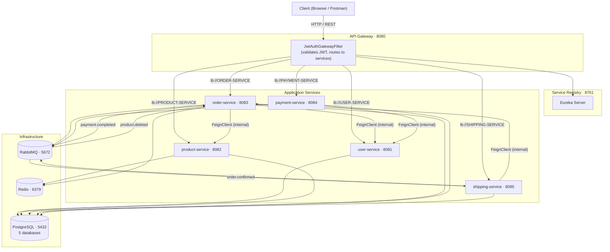

# CommerceX

A production-ready **e-commerce microservices platform** built with Spring Boot 4, Spring Cloud, and Java 21. Manages users, products, orders, payments, and shipping across 5 independent services behind an API gateway.

---

## Architecture



---

## Tech Stack

| Layer | Technology |
|---|---|
| Language | Java 21 |
| Framework | Spring Boot 4.0.4 |
| Service Discovery | Spring Cloud Netflix Eureka |
| API Gateway | Spring Cloud Gateway (WebFlux) |
| Inter-Service HTTP | Spring Cloud OpenFeign |
| Async Messaging | RabbitMQ (AMQP) |
| Persistence | Spring Data JPA + PostgreSQL 16 |
| Caching | Spring Cache + Redis 7 |
| Security | Spring Security + JWT (jjwt 0.12) |
| API Documentation | SpringDoc OpenAPI 2.8.6 (Swagger UI) |
| Build | Apache Maven 3.9 (multi-module) |
| Containerisation | Docker + Docker Compose |
| CI | GitHub Actions |
| Tests | JUnit 5 + Mockito + Testcontainers |

---

## Module Structure

```
commercex/                       <- Parent POM (packaging=pom)
├── common-lib/                  <- Shared: BaseEntity, exceptions, JwtUtil, filters
├── eureka-server/               <- Service registry (port 8761)
├── api-gateway/                 <- JWT validation + routing (port 8080)
├── user-service/                <- Auth, users, password reset (port 8081)
├── product-service/             <- Products, categories, stock (port 8082)
├── order-service/               <- Orders, cart, discounts (port 8083)
├── payment-service/             <- Payment gateway simulation (port 8084)
└── shipping-service/            <- Shipments, tracking, notifications (port 8085)
```

---

## Prerequisites

| Tool | Version |
|---|---|
| Java (Temurin) | 21 |
| Apache Maven | 3.9+ (or use `./mvnw`) |
| Docker + Compose | 24+ |
| PostgreSQL | 16 (or run via Docker) |
| Redis | 7 (or run via Docker) |
| RabbitMQ | 3 (or run via Docker) |

---

## Quick Start — Docker Compose

The fastest way to run the full stack:

```bash
# 1. Clone the repository
git clone https://github.com/chanduj9876/CommerceX.git
cd commercex
git checkout microservice

# 2. Build all service images and start infrastructure + services
docker compose up -d --build

# 3. Check everything is healthy
docker compose ps

# 4. Test through the gateway
curl http://localhost:8080/api/v1/products
```

> **First start:** `docker/init-databases.sql` auto-creates all 5 databases.
> All services register with Eureka within ~30 s of starting.

---

## Quick Start — Manual (Local Dev)

### 1 — Start infrastructure

```bash
docker run -d --name cx-postgres -e POSTGRES_PASSWORD=postgres -p 5432:5432 postgres:16
docker run -d --name cx-redis   -p 6379:6379 redis:7-alpine
docker run -d --name cx-rabbit  -p 5672:5672 -p 15672:15672 rabbitmq:3-management
```

### 2 — Create databases

```sql
psql -U postgres -c "CREATE DATABASE commercex_users;"
psql -U postgres -c "CREATE DATABASE commercex_products;"
psql -U postgres -c "CREATE DATABASE commercex_orders;"
psql -U postgres -c "CREATE DATABASE commercex_payments;"
psql -U postgres -c "CREATE DATABASE commercex_shipping;"
```

### 3 — Start services in order

```bash
./mvnw spring-boot:run -pl eureka-server          # service registry — start first

./mvnw spring-boot:run -pl user-service           # port 8081
./mvnw spring-boot:run -pl product-service        # port 8082
./mvnw spring-boot:run -pl order-service          # port 8083
./mvnw spring-boot:run -pl payment-service        # port 8084
./mvnw spring-boot:run -pl shipping-service       # port 8085

./mvnw spring-boot:run -pl api-gateway            # port 8080 — start last
```

---

## API Reference

All requests go through the **API Gateway** at `http://localhost:8080`.

### Swagger UI (direct to each service)

| Service | URL |
|---|---|
| user-service | http://localhost:8081/swagger-ui.html |
| product-service | http://localhost:8082/swagger-ui.html |
| order-service | http://localhost:8083/swagger-ui.html |
| payment-service | http://localhost:8084/swagger-ui.html |
| shipping-service | http://localhost:8085/swagger-ui.html |

### Key Endpoints

#### Authentication (no JWT required)

| Method | Path | Description |
|---|---|---|
| `POST` | `/api/v1/auth/register` | Register a new user |
| `POST` | `/api/v1/auth/login` | Login, receive JWT |
| `POST` | `/api/v1/auth/forgot-password` | Request password reset token |
| `POST` | `/api/v1/auth/reset-password` | Reset with token |

#### Products

| Method | Path | Description |
|---|---|---|
| `GET` | `/api/v1/products` | List all (paginated) |
| `GET` | `/api/v1/products/{id}` | Get by ID |
| `GET` | `/api/v1/products/search` | Filter by name/price/category |
| `POST` | `/api/v1/products` | Create (**ADMIN**) |
| `PUT` | `/api/v1/products/{id}` | Replace (**ADMIN**) |
| `PATCH` | `/api/v1/products/{id}` | Partial update (**ADMIN**) |
| `PATCH` | `/api/v1/products/{id}/stock` | Update stock (**ADMIN**) |
| `DELETE` | `/api/v1/products/{id}` | Delete (**ADMIN**) |

#### Cart and Orders

| Method | Path | Description |
|---|---|---|
| `GET` | `/api/v1/cart` | Get current cart |
| `POST` | `/api/v1/cart/items` | Add item |
| `PUT` | `/api/v1/cart/items/{id}` | Update quantity |
| `DELETE` | `/api/v1/cart/items/{id}` | Remove item |
| `DELETE` | `/api/v1/cart` | Clear cart |
| `POST` | `/api/v1/orders` | Create order from cart |
| `GET` | `/api/v1/orders/my-orders` | My orders |
| `GET` | `/api/v1/orders/{id}` | Get order |
| `PATCH` | `/api/v1/orders/{id}/cancel` | Cancel order |
| `GET` | `/api/v1/orders` | All orders (**ADMIN**) |
| `PATCH` | `/api/v1/orders/{id}/status` | Update status (**ADMIN**) |

#### Payments and Shipments

| Method | Path | Description |
|---|---|---|
| `POST` | `/api/v1/payments/initiate` | Initiate payment |
| `POST` | `/api/v1/payments/confirm/{txnId}` | Confirm payment |
| `GET` | `/api/v1/payments/{txnId}` | Get payment |
| `GET` | `/api/v1/payments/order/{orderId}` | Payments for an order |
| `POST` | `/api/v1/shipments` | Create shipment (**ADMIN**) |
| `GET` | `/api/v1/shipments/{trackingId}` | Track shipment |
| `PATCH` | `/api/v1/shipments/{trackingId}/status` | Update status (**ADMIN**) |
| `GET` | `/api/v1/shipments/order/{orderId}` | Shipment by order |

---

## End-to-End Flow

```
1.  POST /api/v1/auth/register          -> create account
2.  POST /api/v1/auth/login             -> receive JWT
3.  POST /api/v1/products               -> create product  [ADMIN]
4.  POST /api/v1/cart/items             -> add to cart
5.  POST /api/v1/orders                 -> place order (clears cart, deducts stock via Feign)
6.  POST /api/v1/payments/initiate      -> initiate payment
7.  POST /api/v1/payments/confirm/{id}  -> confirm payment
                                            | RabbitMQ: payment.completed
8.                                      -> order-service updates order -> CONFIRMED
                                            | RabbitMQ: order.confirmed
9.                                      -> shipping-service auto-creates shipment
10. GET  /api/v1/shipments/{trackingId} -> track shipment
11. PATCH /api/v1/shipments/{id}/status -> update to DELIVERED  [ADMIN]
```

---

## Postman Collection

Import `commercex.postman_collection.json` from the project root.

- **32 pre-configured requests** across all 7 groups
- `{{base_url}}` variable (default: `http://localhost:8080`)
- `{{jwt_token}}` auto-populated by the **Login** request via test script
- Resource IDs (`product_id`, `order_id`, `tracking_id`) auto-captured from creation responses

---

## Environment Variables

| Variable | Default | Description |
|---|---|---|
| `SPRING_DATASOURCE_URL` | `jdbc:postgresql://localhost:5432/<db>` | Per-service DB URL |
| `SPRING_DATASOURCE_USERNAME` | `postgres` | DB username |
| `SPRING_DATASOURCE_PASSWORD` | `postgres` | DB password |
| `SPRING_RABBITMQ_HOST` | `localhost` | RabbitMQ host |
| `SPRING_RABBITMQ_PORT` | `5672` | RabbitMQ AMQP port |
| `SPRING_DATA_REDIS_HOST` | `localhost` | Redis host |
| `SPRING_DATA_REDIS_PORT` | `6379` | Redis port |
| `JWT_SECRET` | (base64 encoded key) | Shared JWT signing secret |
| `EUREKA_CLIENT_SERVICEURL_DEFAULTZONE` | `http://localhost:8761/eureka/` | Eureka URL |

---

## Running Tests

```bash
# Unit tests only
./mvnw test -pl common-lib,user-service,product-service,order-service,payment-service,shipping-service -am

# Integration tests (Testcontainers — requires Docker)
./mvnw verify -pl order-service,payment-service,shipping-service -am

# Full build + all tests
./mvnw verify
```

---

## CI/CD

GitHub Actions workflow at `.github/workflows/ci.yml`:

| Job | Trigger | Steps |
|---|---|---|
| **Build and Test** | Every push and PR | Checkout -> Java 21 -> create test DBs via service containers -> `mvn test` -> `mvn package` -> upload artifacts |
| **Docker Build** | Push to `main` only | `docker compose build --parallel` -> verify images |

---

## License

MIT
